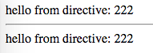

AngularJS1 Directive Scope False Demo
=====================================

`scope`
-------

- `false` (default): No scope will be created for the directive. The directive will use its parent's scope.

也就是说，directive中只要用到`$scope`，拿到的就是parent的`$scope`。
所以在directive中对scope所做的所有修改，都会反映在parent上。

```
npm install
open index.html
```



Resources
---------

- AngularJS1: <https://angularjs.org/>
- directive scope api: <https://docs.angularjs.org/api/ng/service/$compile#-scope->
- $element api: <https://docs.angularjs.org/api/ng/function/angular.element#angularjs-s-jqlite>